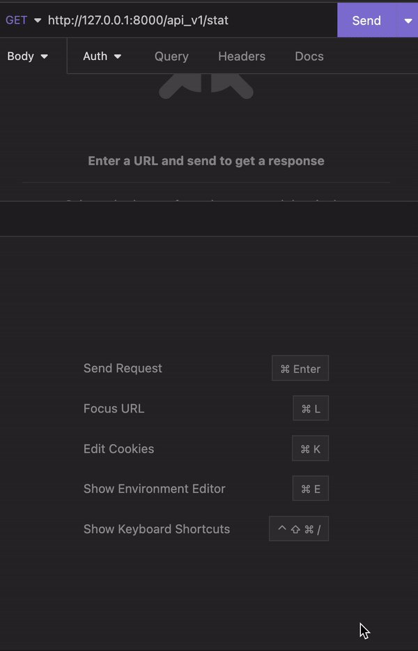
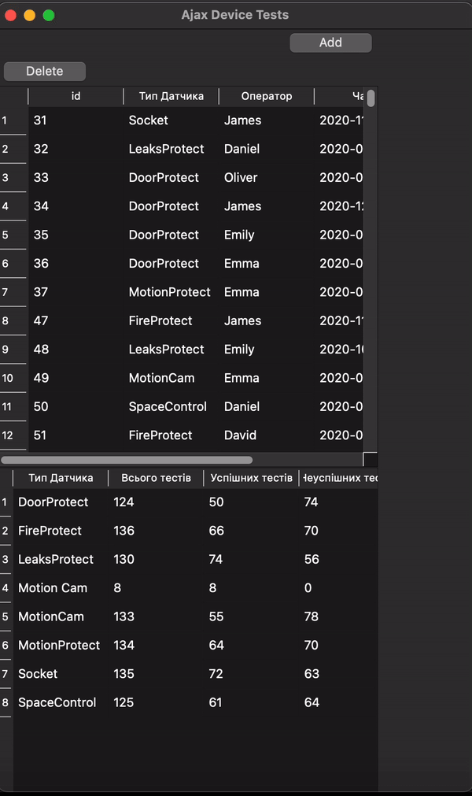

# konak-v-ajax-test
Ajax interview practical assignment

This is a repo for assignment for AJAX SYSTEMS interview. Written in Django and PyQT5

Start server.
Navigate to `konak-v-ajax-test/ajax` directory.
It already contains db.sqlite3 file with applied migrations and sample data.
Activate virtual environment
Run 
```
pip install -r requirements.txt
python manage.py runserver
```

Open another terminal window, go to `desktop_ui` dir and  activate same virtualenv and run
```
python app.py
```

# API DEMO with filtering



# UI DEMO 

(adding new records is done by passing into api  hardcoded values from UI)
